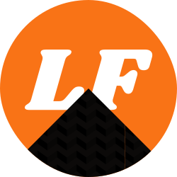
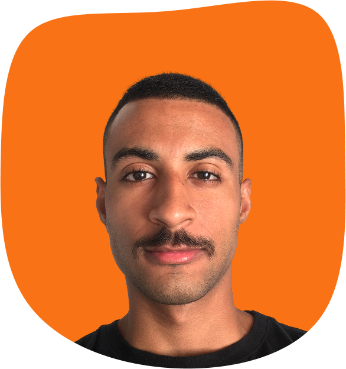

# Luan Florencio Portfolio

   

Este é o repositório do meu portfólio pessoal, desenvolvido com **Next.js 15**, **React 19** e **Tailwind CSS 4**. O site foi projetado para ser rápido, responsivo, minimalista e acessível, oferecendo uma experiência fluida e moderna para os visitantes.

Visite meu portfólio:

[](https://florencioo.vercel.app/)


## Sumário
- [Funcionalidades](#funcionalidades)
- [Tecnologias Utilizadas](#tecnologias-utilizadas)
- [Instalação](#instalação)
- [Estrutura do Projeto](#estrutura-do-projeto)
- [Como Contribuir](#como-contribuir)

## Funcionalidades

- 🌗 **Suporte a tema claro/escuro** com persistência da preferência do usuário
- 🌍 **Internacionalização (i18n)** para diferentes idiomas (Português e Inglês)
- 📱 **Responsividade completa** para dispositivos móveis, tablets e desktops
- ⚡ **Desempenho otimizado** com renderização eficiente e carregamento rápido
- 🎨 **Design moderno e minimalista** utilizando Tailwind CSS e Shadcn-UI

## Tecnologias Utilizadas

- [Next.js 15](https://nextjs.org/) - Framework para React
- [React 19](https://react.dev/) - Biblioteca para construção da interface
- [Tailwind CSS 4](https://tailwindcss.com/) - Framework CSS utilitário
- [Shadcn/UI](https://ui.shadcn.com/) - Biblioteca de componentes UI
- [TypeScript](https://www.typescriptlang.org/) - Tipagem estática opcional para JavaScript
- [next-intl](https://next-intl.dev/) - Gerenciamento de internacionalização

## Instalação

Para rodar o projeto localmente, siga os passos abaixo:

```bash
# Clone o repositório
git clone https://github.com/LuanFlorencioo/florencioo.git

# Acesse o diretório do projeto
cd florencioo

# Instale as dependências
npm install  # ou yarn install

# Inicie o servidor de desenvolvimento
npm run dev  # ou yarn dev
```

O projeto estará disponível em **http://localhost:3000**.

> Caso você nunca tenha usado ou experimentado as funcionalidades do NextJS (que é usado neste projeto) e gostaria de entender ou aprender, acesse o https://nextjs.org/

## Estrutura do Projeto

```
📁 florencioo
│-- 📁 public            # Arquivos estáticos (imagens, ícones, etc.)
│-- 📁 src               # Código-fonte principal
│   ├── 📁 app           # Páginas e roteamento da aplicação
│   ├── 📁 components    # Componentes reutilizáveis
│   ├── 📁 data          # Dados (dados pessoais, links, etc.)
│   ├── 📁 font          # Fonte e tipografia utilizada na aplicação
│   ├── 📁 hooks         # Hooks personalizados
│   ├── 📁 i18n          # Configuração de internacionalização
│   ├── 📁 lib           # Funções Utilitários
│   ├── 📁 styles        # Estilos globais e configuração do TailwindCSS
│   ├── 📁 translations  # Traduções
│   ├── 📁 ui            # Componentes UI do Shadcn
│-- 📄 components.json   # Configurações do Shadcn
│-- 📄 next.config.ts    # Configurações do Next.js
│-- 📄 package.json      # Dependências do projeto
│-- 📄 tsconfig.json     # Configuração do TypeScript
```

## Como Contribuir

Se quiser contribuir com melhorias ou sugestões, fique à vontade para abrir um **pull request** ou criar uma **issue**. Se preferir, pode até me mandar mensagem pelo **discord**

[](https://discord.com/users/luanflorencio)

---

💻 Desenvolvido por [Luan Florencio](https://florencioo.vercel.app/) - @LuanFlorencioo


