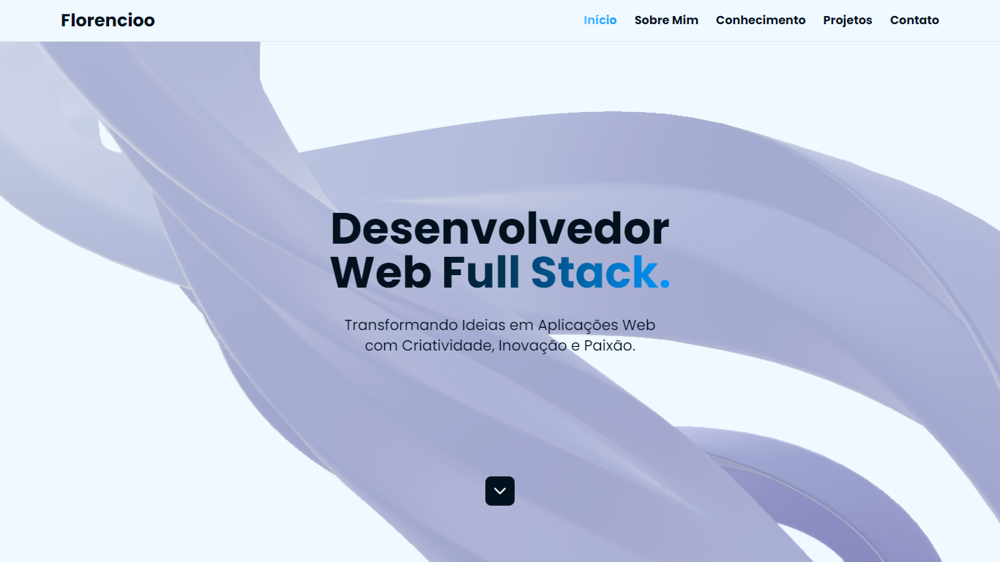

  
  <h1 style="color: #46b6ff">Luan Florencio</h1>

Sinta-se à vontade para explorar meu site pessoal, onde compartilho detalhes sobre minha trajetória profissional como desenvolvedor web. Lá, você terá acesso aos meus mais recentes e destacados projetos, assim como às formas de entrar em contato comigo. Convido você a conferir em [florencioo.vercel.app](https://florencioo.vercel.app/) e conhecer mais sobre meu trabalho e experiência.

## Tecnologias usadas:

> TypeScript é uma linguagem de programação fortemente tipada baseada em JavaScript, oferecendo melhores ferramentas em qualquer escala.

> Next.js é uma estrutura React para construir aplicativos web full-stack. Permite funcionalidades como renderização do lado do servidor e geração de sites estáticos para aplicativos da web baseados em React.

> Tailwind CSS é uma estrutura CSS de código aberto. A principal característica desta biblioteca é que, ao contrário de outros frameworks CSS como Bootstrap, ela não fornece uma série de classes predefinidas para elementos como botões ou tabelas.

> Framer Motion é uma biblioteca de animações que permite manipular transições e animações em componentes de maneira simples e prática.

> Zustand é uma biblioteca de gerenciamento de estados simples, rápida e escalável usando princípios de fluxo simplificados. Possui uma API confortável baseada em ganchos.

